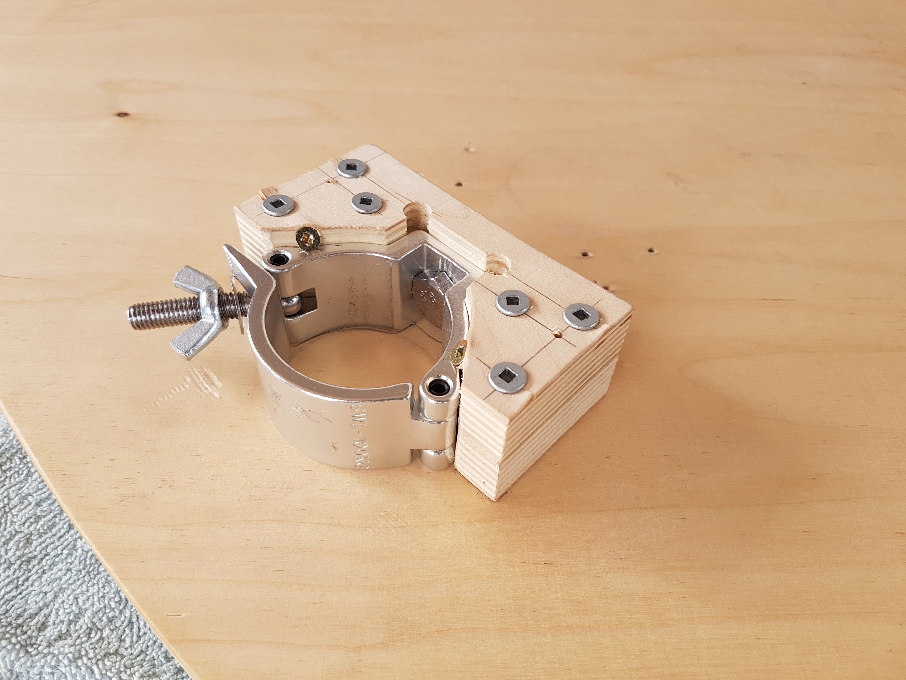
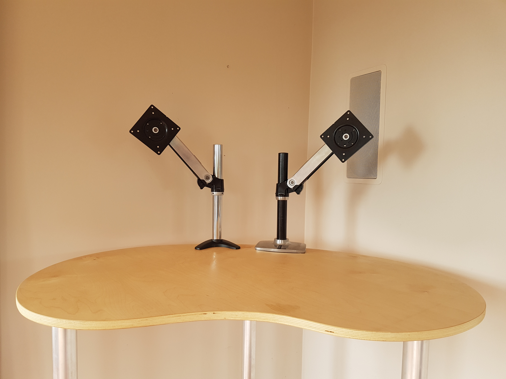
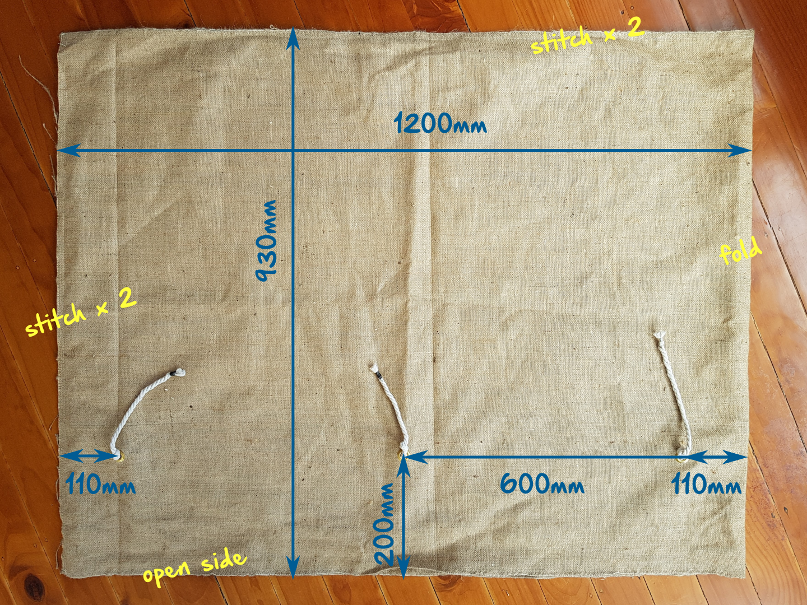

# Minimalistic standing desk with detachable legs for small places

Wouldn't it be cool if you could "fold" your home-office furniture and free the space for other activities?

#### Demo video: https://www.youtube.com/watch?v=HdWBJu45pjg

The desk has [the shape of a bean](http://freevector.co/vector-icons/food/jelly-bean.html). It is more ergonomic than conventional rectangular designs.

* **Size**: 110cm wide x 75cm deep x 110cm high
* **Size in storage**: 110cm x 75cm x 8cm

# Ordering

#### This desk is an open-source furniture project that can be ordered from your local joinery company:

1. Download the design files
2. Email the files to a few local joiners/cabinet-makers for a quote
3. Choose the type of the top from the materials and colors they offer
4. Pickup the desk from the joiner a few days later

See more detailed ordering information at the end of this post.

---

# Design details

## Top

The pictured design was made out of 18mm thick *New Zealand Pine Plywood* with *Danish Oil* coating. It was chosen for its strength and environmental qualities. Other suitable choices include:

* coated and uncoated PLY, 18mm or thicker
* MDF, 20mm or thicker with or without melamine or other protective coatings

## Quick-detach interface

The novel part of this desk design is how it packs away and comes back up in just one minute using a scaffolding clamp.

The clamp is held tight inside a special cut out. Its main connection point is through an M10 bolt at the back. 

#### Disclaimer

*Our workshop went into a total lockdown over COVID-19 and we didn't get a chance to retrieve a properly assembled desk to photograph. Given the urgency, I photographed the very first prototype I use at home, so excuse the extra holes and ugly screws you see in some of the photos.*

#### USE DOWELS IN PLACE OF SCREWS

1. Fix both parts of the interface to the bottom side of the desk using dowels.
2. Make sure all surfaces are pressed tightly and have no gaps.
3. Insert the clamp into the interface before it dries for a tighter fit.
4. Press the clamp closer to the bottom surface of the top board with 2 or more additional screws at 45-degrees.

The interface parts are cut out of the same sheet as the top board. You may need to stack more than 2 layers if your sheet is thinner than 18mm.

The diameter of the dowels can be changed to match the diameter of your main cutter. 

## Legs

The legs are made out of 50mm aluminium tube cut to a set length (1100mm in my case). Any reasonably priced aluminium tube with wall thickness between 1.5mm and 3mm is suitable for this purpose. 

**Recommended configuration**: 50mm OD, 1.6mm wall thickness, 1100mm for a 180cm tall person, 3 legs per desk.

A 3-legged desk is sufficiently stable with symmetrical load. E.g. a single extra monitor in the center or 2 extra monitors, one on each side. Use 4 legs if the load is asymmetrical.

## Desk height

This desk is higher than most commercial models you'll find in furniture stores. Placing the top of the desk just under the elbows gives better body support for a more upright and relaxed posture. This is a matter of preference - you can choose any height of the legs to suit your needs. 

According to [the golden ratio model of human body](http://tools.openlab.psu.edu/tools/proportionality_constants.htm), a person 178cm tall has 112cm floor-to-elbow height. Multiply your full height by 0.63 to calculate your desk legs hight or measure it with a tape. Take into account the footwear and an [anti-fatigue mat](https://www.ncbi.nlm.nih.gov/pubmed/23964416) you may use while standing at the desk.

## Feet

The feet are round cutouts. One goes inside the leg, the other has the same OD as the leg (50mm) and stays outside. Join the two halves together and push hard into the leg to set it in place. Use padding such as paper or fabric if the foot is a bit loose. The feet are cut out of the same sheet as the top.

Extra stability from tipping (e.g. if someone pushes it) can be added with small bags of salt stuffed inside the legs.

Use coarse salt in a sock or a stocking. 3 cups of salt per leg make the desk very stable against someone accidentally pushing it with their body. 5 cups of salt make the desk almost anchored to the floor.

## Latex band

The latex band hooks onto the clamps and holds the legs in place while in storage. Amazons and fitness stores have plenty of latex bands on offer, but a no-name band from a discount store will do just fine.

* **Latex band**: 1000mm x 20mm x 4mm

## Storage bag

It's easy to damage the surface of the desk while carrying it or leaning other hard things onto it while in storage. The bag is not a guarantee, but it does offer some protection.

* **Material**: jute / burlap fabric, 900-930mm wide x 2.4m long
* **Eyelets**: 15mm x 3pcs
* **Ties**: 6mm ... 10mm cotton cord, 700mm long x 3
* **Tie ends**: use metal crimps or wire or glue to stop the ends from coming apart

We used cotton cord for ties to keep our design completely plastic-free. You can use a synthetic cord that can be easily melted at the ends to stop them from fraying.

#### A double-stich or a more strong pattern is recommended.

#### Use fabric with overlocked edges

#### The knots on both sides of the eyelet are stopping the cord from coming out and getting lost

---

# Detailed ordering information

Refer to *Design Details* section above for more info on the components. Understanding how they fit together will make ordering easier.

You should be able to order everything locally. Any town with 400,000+ people should have all the supplies you need and at least a few joiner companies to cut the top for you.

* **Ordering everything yourself**: allow 30min to an hour to find suppliers and place orders. Ship everything to the joiner for the final assembly.
* **Asking your joiner to order everything**: this is an easier option, but expect an extra charge for shipping and handling.

### Finding a joiner
Look for a company that makes custom flat-pack furniture, such as kitchens or wardrobes. They usually have a special machine called *CNC router* to cut all the parts you need within a few minutes. A good joiner should be able to cut and assemble your desk with ease. 

Send them all an email with [files from `ordering` folder](ordering) and a link to this post asking for a quote and if they can order the legs and the clamps for you as well.

### List of parts

Remember, the desk can be made with 3 or 4 legs. Adjust the quantities accordingly.

1. Sheet of PLY or MDF, min size 1150mm x 1000mm
2. Global Truss [Mini 360](https://www.globaltruss.com/mini-360) or [Mini 360 QR](https://www.globaltruss.com/mini-360-qr) clamps, x3 or x4 pcs (3 or 4 legs)
   * BeamZ SWL-100 coupler can also be used
3. M10 zinc-plated or SS nut, x3/x4 pcs to replace M10 wing-nuts on the clamps
4. 6G x 20mm chipboard screws, x12/x16 pcs
5. Aluminium tube 50mm outer diameter (OD) x 1.6mm ... 3mm wall x 1100mm long , x3/x4 pcs
   * Google search: https://www.google.com/search?q=aluminum+tube+cut+to+size
   * The choice may be confusing and overwhelming - any material or finish will do, just get the cheapest one from whoever can cut it to size with least hassle
   * Request 1mm cut precision
   * Optionally, ask for sanding or deburring of the cut edges to remove sharp bits
6. Latex band, 1m long loop, approximately 2cm ... 3cm wide, medium strength
   * Check your local discount store. It's a $5 ... $10 item.

7. Bag order - read *Bag section* above
   * Do you even need a bag?
   * If you do, find someone local who works with jute fabric: https://www.google.com/search?q=custom+jute+bags or https://www.google.com/search?q=custom+jute
   * Email them [this image](img/bag.png) for a quote
   * The job should take them about 15 minutes: 1 cut, 2 stitches, 3 eyelets.

### Shipping the desk to you

Courier services should be able to ship the desk to your door. 

Get the bag shipped directly to the joiner. It's the easiest packaging option. Ask the joiner to line the inside of the bag with a sheet of cardboard to protect the edges and surfaces while in transit. 
* **Packaged size**: 110cm x 75cm x 8cm
* **Packaged weight**: 10kg

### Getting your desk for free

A standard sheet of plywood or MDF fits 3 desk-tops, but the cost of cutting and assembling all three is about the same as making one. You can order 3, sell 2 with a 50% markup on eBay and get your money back.
